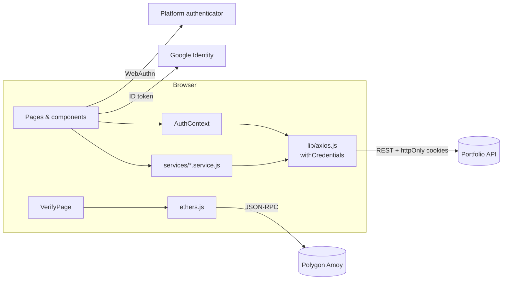

<div align="center">

# Portfolio Platform — Frontend

**The personal portfolio, blog and admin dashboard of Suryanshu Verma**

A React single-page app that renders a fully CMS-driven portfolio and ships its own admin dashboard, so every section of the site can be edited live without touching code.

[](https://react.dev)
[](https://vite.dev)
[](https://tailwindcss.com)
[](https://motion.dev)
[](https://vercel.com)

[Live Site](https://suryanshuverma.com.np) ·
[Backend Repo](https://github.com/suryanshuverma0/portfolio-backedn) ·
[API Docs](https://portfolio-backend-uy0a.onrender.com/api-docs)

</div>

---

## Table of Contents

- [Overview](#-overview)
- [Features](#-features)
- [Tech Stack](#-tech-stack)
- [Getting Started](#-getting-started)
- [Environment Variables](#-environment-variables)
- [Scripts](#-scripts)
- [Routes](#-routes)
- [Project Structure](#-project-structure)
- [Architecture](#-architecture)
- [Deployment](#-deployment)
- [Further Documentation](#-further-documentation)
- [Author](#-author)

---

## 📌 Overview

The app has two faces:

1. **Public portfolio** — hero, about, experience, skills, services, projects with full case-study pages, certificates, live coding activity, a blog and a contact form.
2. **Admin dashboard** (`/dashboard`) — a CMS for every one of those sections, plus analytics, a message inbox, comment moderation, user management, passkey security and site-wide settings.

All content is fetched from the [Portfolio Backend API](https://github.com/suryanshuverma0/portfolio-backedn). Authentication uses `httpOnly` cookies, so no tokens are ever stored in the browser.

---

## ✨ Features

### Public site

- 🎨 **Light / dark theme** — follows the OS preference, remembers the user's choice, and is applied before first paint (no flash).
- ⚡ **Animated UI** — Framer Motion page transitions, typewriter hero, initial loader and skeleton states.
- 🗂 **Projects** — featured and regular project cards, image galleries, and dedicated case-study pages (`/projects/:slug`) with architecture diagrams, features, challenges, learnings and evaluation metrics.
- ✍️ **Blog** — Markdown posts rendered with GitHub-flavoured Markdown and syntax highlighting, tag filtering, and moderated comments.
- 📊 **Live coding activity** — real-time GitHub and LeetCode stats pulled through the backend.
- ✉️ **Contact form** — validated with React Hook Form + Zod; visitors receive an automatic acknowledgement email.
- ⛓ **On-chain verification** (`/verify`) — reads a smart contract on the **Polygon Amoy** testnet with ethers.js to prove portfolio authorship; the home page offers a verification modal with a shareable QR code.
- 🔍 **SEO** — per-page meta tags via `react-helmet-async`, driven by admin-editable settings; `robots.txt` included.
- 🚧 **Maintenance mode** — the admin can take the public pages offline with one toggle, while login and the dashboard stay reachable.
- 📈 **Privacy-friendly analytics** — anonymous visitor ID (no cookies, no third-party trackers) posted on each page view.

### Authentication

- 🔑 Email + password with forgot/reset-password flow
- 🟢 Google Sign-In
- 🔐 **Passkeys (WebAuthn)** — passwordless sign-up and login, plus "add this device" linking via an emailed one-time link
- 🛡 Role-based routing — admins land in `/dashboard`; other users go to `/account`

### Admin dashboard

| Section | Capabilities |
| --- | --- |
| **Dashboard** | KPIs with trend deltas, visitor trend chart, recent-activity feed, live counts |
| **Content** | Profile, Education, Stats, Experience, Services, Projects, Certificates, Skills — create, edit, set display order, hide/show, image uploads |
| **Blog** | Markdown editor with live preview, cover images, tags, drafts, comment moderation |
| **Messages** | Contact inbox with read state and in-app email replies |
| **Analytics** | Page views, unique visitors, top pages, referrers, devices, browsers, countries (Recharts) |
| **Users** | View and remove registered users |
| **Security** | Register, rename and revoke passkeys |
| **Settings** | SEO metadata, social links, contact details, résumé URL, footer, maintenance mode, public sign-up toggle |

---

## 🛠 Tech Stack

| Concern | Library |
| --- | --- |
| Framework | React 18 |
| Build tool | Vite 8 |
| Styling | Tailwind CSS 4 (via `@tailwindcss/vite`), CSS design tokens |
| Routing | React Router 7 |
| Animation | Framer Motion, `typewriter-effect` |
| HTTP | Axios (`withCredentials`) |
| Forms & validation | React Hook Form, Zod, `@hookform/resolvers` |
| Auth | `@react-oauth/google`, `@simplewebauthn/browser` |
| Content | `react-markdown`, `remark-gfm`, `rehype-highlight` |
| Charts | Recharts |
| Blockchain | ethers.js v6 |
| UI | Lucide icons, React Icons, React Toastify, `react-multi-carousel`, `react-qr-code` |
| SEO | `react-helmet-async` |
| Linting | ESLint 10 with React Hooks and React Refresh plugins |

---

## 🚀 Getting Started

### Prerequisites

- **Node.js 20.19+** or **22.12+** (required by Vite 8)
- npm
- A running instance of the [backend API](https://github.com/suryanshuverma0/portfolio-backedn) — or use the production API
- A Google OAuth client ID (for Google Sign-In)

### Installation

```bash
# 1. Clone the repository
git clone https://github.com/suryanshuverma0/React-Portfolio.git
cd React-Portfolio

# 2. Install dependencies
npm install

# 3. Configure environment
cp .env.example .env
# then set VITE_GOOGLE_CLIENT_ID

# 4. Start the dev server
npm run dev
```

Open **http://localhost:5173**.

### Pointing at a local backend

The API base URL is set in [`src/lib/axios.js`](src/lib/axios.js) and defaults to the production API. To develop against a local backend, change it to:

```js
baseURL: "http://localhost:3000/api/v1",
```

`http://localhost:5173` is already whitelisted in the backend's CORS and WebAuthn origins.

### Accessing the dashboard

Register or sign in with an email listed in the backend's `ADMIN_EMAILS`. You'll be redirected to `/dashboard`.

---

## 🔐 Environment Variables

| Variable | Required | Description |
| --- | :---: | --- |
| `VITE_GOOGLE_CLIENT_ID` | ✅ | Google OAuth Web client ID. Must be the same client ID the backend uses as `GOOGLE_CLIENT_ID`. |

> Vite only exposes variables prefixed with `VITE_` to the browser, and they are **embedded in the public bundle** — never put secrets here.

---

## 📜 Scripts

| Command | Description |
| --- | --- |
| `npm run dev` | Start the Vite dev server with HMR on port 5173. |
| `npm run build` | Production build into `dist/`. |
| `npm run preview` | Serve the production build locally. |
| `npm run lint` | Run ESLint over the project. |

---

## 🧭 Routes

### Public

| Path | Page |
| --- | --- |
| `/` | Home — all portfolio sections |
| `/projects/:slug` | Project case study |
| `/blog` | Blog index |
| `/blog/:slug` | Blog post with comments |
| `/verify` | Blockchain verification |

### Auth

| Path | Page |
| --- | --- |
| `/login` | Password, Google or passkey login; "add this device" |
| `/register` | Password, Google or passkey sign-up |
| `/forgot-password` | Request a reset email |
| `/reset-password/:token` | Set a new password |
| `/link-passkey/:token` | Add a passkey from an emailed link |
| `/account` | Signed-in non-admin users |

### Admin (`/dashboard`, admin role required)

`/dashboard` · `profile` · `education` · `stats` · `experience` · `services` · `projects` · `certificates` · `skill` · `blog` · `blog/new` · `blog/:id/edit` · `blog/comments` · `messages` · `analytics` · `users` · `security` · `settings`

Public routes are wrapped in a **maintenance gate**; auth and admin routes are not, so the admin can always sign in and switch maintenance mode off.

---

## 📁 Project Structure

```
portfolio-frontend/
├── index.html                 # Pre-paint theme script, root element
├── vite.config.js             # React + Tailwind plugins
├── vercel.json                # SPA rewrite: all paths → index.html
├── public/                    # Static files served as-is (favicon, robots.txt)
└── src/
    ├── main.jsx               # Providers: Google OAuth, Helmet, Router, Auth, Toasts
    ├── App.jsx                # Route table, maintenance gate, page transitions
    ├── admin/                 # ── Admin dashboard ──
    │   ├── layout/            # AdminLayout, Sidebar, Header
    │   ├── pages/             # One page per CMS section
    │   ├── components/        # Form inputs, uploaders, Markdown editor, modals, stat cards
    │   ├── services/          # Admin API calls (one file per backend module)
    │   └── constants/         # Sidebar navigation config
    ├── pages/                 # Public & auth pages (Home, Blog, ProjectDetails, Login, …)
    ├── components/
    │   ├── sections/          # Home sections: About, Experience, Skills, Projects, …
    │   ├── home/  layout/     # Hero, Navbar, Footer
    │   ├── auth/              # Auth form building blocks, Google & passkey buttons
    │   ├── blog/              # Markdown renderer, comment section
    │   ├── common/            # SEO, loaders, skeletons, page transition, maintenance screen
    │   ├── content/           # Static copy (section headings, labels)
    │   ├── modals/  cards/  ui/  routes/
    ├── services/              # Public API calls (public.*.service.js)
    ├── contexts/AuthContext.jsx  # Session state + login/register/passkey actions
    ├── lib/                   # Axios instance, visitor ID, social links
    ├── blockchain/contract.js # Contract address + ABI
    ├── validations/           # Zod schemas for auth forms
    ├── styles/globals.css     # Tailwind import + design tokens (light & dark)
    └── assets/                # Images and project screenshots
```

---

## 🏗 Architecture



- **Service layer** — components never call Axios directly; each backend module has a matching `public.*.service.js` (public site) or `admin/services/*.service.js` (dashboard).
- **Auth** — `AuthContext` restores the session on load via `GET /auth/me`, and exposes login, Google, passkey, register and logout actions. `ProtectedRoute` gates `/dashboard` by role.
- **Theming** — design tokens are CSS variables in `styles/globals.css`, consumed as Tailwind utilities (`bg-background`, `text-primary`, …) and swapped under `.dark`.

More detail: [docs/ARCHITECTURE.md](docs/ARCHITECTURE.md).

---

## ☁️ Deployment

Deployed on **Vercel** at [suryanshuverma.com.np](https://suryanshuverma.com.np). `vercel.json` rewrites every path to `index.html` so client-side routes work on refresh.

```bash
npm run build   # outputs dist/
```

Full guide: [docs/DEPLOYMENT.md](docs/DEPLOYMENT.md).

---

## 📚 Further Documentation

| Document | Contents |
| --- | --- |
| [docs/ARCHITECTURE.md](docs/ARCHITECTURE.md) | Data flow, auth, theming, analytics, blockchain verification, conventions |
| [docs/DEPLOYMENT.md](docs/DEPLOYMENT.md) | Vercel, custom domain, Google OAuth and backend configuration |
| [Backend README](https://github.com/suryanshuverma0/portfolio-backedn#readme) | API, security and server setup |

---

## 👤 Author

**Suryanshu Verma**

- Website — [suryanshuverma.com.np](https://suryanshuverma.com.np)
- GitHub — [@suryanshuverma0](https://github.com/suryanshuverma0)

---

<div align="center">
<sub>© Suryanshu Verma. All rights reserved.</sub>
</div>
